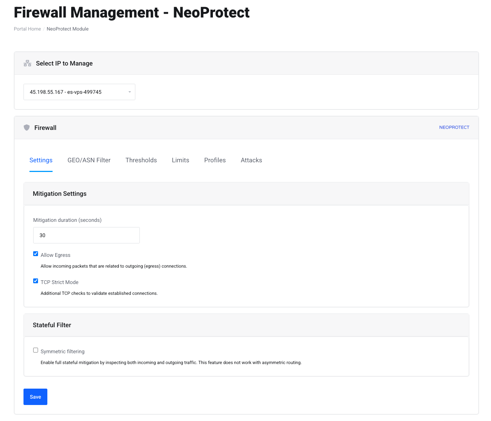

# NeoProtect Module for WHMCS

This project integrates the [NeoProtect API](https://neoprotect.net) with WHMCS, allowing you to manage firewall rules, filters, and view attack history directly through your WHMCS interface.

## Features

### Firewall Management
- **Select IP to Manage:** Select the IP address for which firewall settings and filters will be applied.
- **Mitigation Settings:** Configure the mitigation duration, allow egress traffic, and enable TCP strict mode.
- **Stateful Filter:** Enable full stateful mitigation, inspecting both incoming and outgoing traffic, with the option to enable basic symmetric filtering.
- **Thresholds Configuration:** Set thresholds for various attack types, including TCP-SYN, TCP-ACK, UDP, fragments, and more.
- **Limit Configuration:** Limit packets per second (PPS), bytes per second (BTS), and new connections per protocol (TCP, UDP, ICMP).

### Attack Monitoring
- **Attack History:** View real-time updates of attacks, including the status, signature, and metrics such as packets per second (PPS) and bits per second (BTS).
- **Automated Updates:** Attack data is refreshed automatically every 5 seconds.

### Filtering & Profiles
- **GEO / ASN Filtering:** Enable or disable country or ASN blocking for incoming traffic. Users can whitelist or blacklist countries and ASNs to control access to their IP.
- **Profiles:** Configure custom profiles to adjust firewall mitigation settings based on ports, protocols, and presets. Default action profiles (Filter or Drop) can also be set.
  
### IP Ownership Verification**
- **Secure Access:** Before any action, the module verifies that the current WHMCS user owns the IP address through WHMCS’s internal API, ensuring only authorized changes are made.
 
## Screenshots



## Installation

1. **Clone the Repository**

   Clone or download the repository into your WHMCS /modules/addons/ directory.

2. **Configure API Key**

   Open the `ajax.php` file and go to line 8. Replace the placeholder API key with your actual NeoProtect API key:
   ```php
   $api_key = "YOUR_NEOPROTECT_API_KEY_HERE";
   ```

3. **Set the IP Range**

   Open the `neoprotect_module.php` file and locate lines 54 and 64. Configure these lines to specify the IP range for your deployment.  
   For example, if your IP range starts with `45.`, set these lines to cover that entire range (e.g., all IPs starting with `45.`).

4. **Ensure WHMCS Compatibility**

   - Make sure your WHMCS installation is properly configured.
   - Verify that the server has cURL enabled in PHP to handle API requests.

## Usage

The module provides several AJAX actions to manage firewall settings and view attack history:

- **getFirewallSettings:** Retrieves the current firewall configuration for a specific IP.
- **setFirewallSettings:** Applies firewall rules to the selected IP, including mitigation settings, thresholds, and limits.
- **getAttackHistory:** Fetches historical attack data for the selected IP.
- **applyFilter:** Applies a GEO or ASN filter to the selected IP.
- **createProfile:** Creates a custom profile for firewall settings, based on ports, protocols, and other preferences.
- **saveProfile:** Saves a custom profile after configuration.
- **getProfiles:** Lists available profiles for specific IPs.

## Theme Compatibility

This module is optimized for the **Lagom2** theme. If you're using a different theme, modifications might be needed to adjust the template files for compatibility with the firewall management interface.

## Security Considerations

- **API Key Protection:** Ensure your NeoProtect API key is securely stored and not exposed publicly.
- **Access Control:** The module uses WHMCS’s internal API to validate ownership of IPs, ensuring that only authorized users can modify the firewall settings of their associated IPs.
- **Data Validation:** Always validate inputs before submitting requests to avoid invalid data that could potentially disrupt service.

## Contributing

Contributions, issues, and feature requests are welcome! Feel free to fork the repository and submit pull requests to improve the module.

## License

This project is licensed under the [MIT License](LICENSE).
